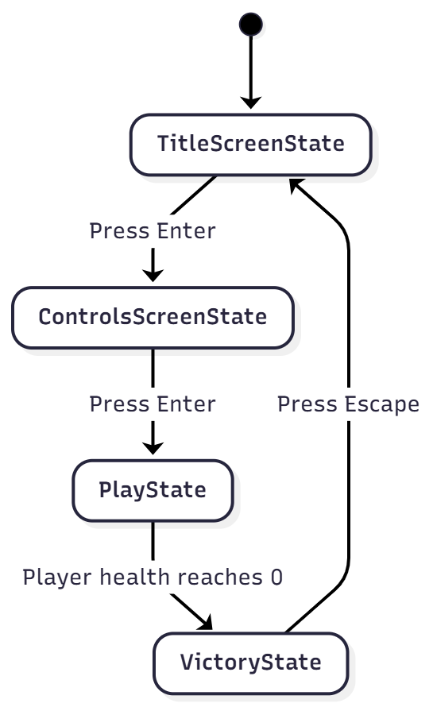

# Final Project

-   [x] Read the [project requirements](https://vikramsinghmtl.github.io/420-5P6-Game-Programming/project/requirements).
-   [x] Replace the sample proposal below with the one for your game idea.
-   [ ] Get the proposal greenlit by Vik.
-   [ ] Place any assets in `assets/` and remember to update `src/config.json`.
-   [ ] Decide on a height and width inside `src/globals.js`. The height and width will most likely be determined based on the size of the assets you find.
-   [ ] Start building the individual components of your game, constantly referring to the proposal you wrote to keep yourself on track.
-   [ ] Good luck, you got this!

---

# Dragon Ball Fighting Game - Project Proposal

## ✒️ Description

In this 2-player fighting game inspired by Dragon Ball Z, two legendary saiyans face off in an epic battle to determine who is the strongest. Players control their fighters using a combination of melee attacks, three unique special moves, and defensive blocking. The arena features platforms, requiring players to master their character's attacks to know which attack to use and when. Victory is achieved by depleting the opponent's health bar through the use of attacks, and special moves.

## 🕹️ Gameplay

Two players face each other in a single-screen arena with a platform. Each fighter starts with 100 HP displayed via health bars at the top of the screen. Players can move freely left and right, jump to avoid attacks, and attack the other player.

**Combat System:**  
The basic melee attack is a quick punch that deals damage with a short-range hitbox directly in front of the fighter. This attack has minimal startup time, making it ideal for quick exchanges and combo pressure.

**Special Attacks:**  
Fighters can reach different levels of Super Saiyan and deal massive amount of damage to their opponent.

**Defense:**  
Players can hold the block button to enter a defensive stance, reducing all incoming damage by 50%. However, blocking prevents movement, creating a risk-reward dynamic. Fighters must decide when to block and when to evade.

**Damage & Knockback:**  
When hit (and not blocking), fighters get stunned. This prevents infinite combos and creates spacing between fighters.

**Victory Conditions:**  
The first player to reduce their opponent's health to zero wins the match. Upon victory, the winner is displayed on a victory screen with option to return to the title screen.

The game is played entirely with keyboard controls, with Player 1 using WASD + E/Q/1/2/3/ and Player 2 using IJKL + O/U/7/8/9.

## 📃 Requirements

### Game Flow

1. The system shall display a title screen when the game launches.
2. The user shall press `Enter` to start a match.
3. The system shall spawn both fighters at starting positions with 100 HP.
4. The system shall transition to victory state when a fighter's health reaches zero.
5. The system shall display the winner on the victory screen.
6. The user shall press `Enter` to return to title.

### Movement

7. The user shall move fighters left/right using `A`/`D` or arrow keys.
8. The user shall jump using `W`.
9. The system shall apply gravity to all fighters.
10. The system shall detect ground collision and prevent falling through.
11. The system shall prevent fighters from moving outside screen boundaries.
12. The system shall prevent fighters from overlapping each other.

### Combat - Basic Attack

13. The user shall press `E` or `O` to perform basic attack.
14. The system shall create an attack hitbox for the attack.
15. The system shall deal damage on hit.
16. The system shall allow attacks while idle, walking, jumping, or falling.

### Combat - Special Attacks

17. The user shall press `1` or `7` for Special Attack 1.
18. The system shall create a area hitbox and deal damage.
19. The user shall press `2` or `8` for Special Attack 2.
20. The system shall create a area hitbox and deal damage.
21. The user shall press `3` or `9` for Special Attack 3.
22. The system shall create a area hitbox and deal damage.

### Defense

23. The user shall hold `Q` or `U` to block.
24. The system shall reduce incoming damage by 50% while blocking.
25. The system shall prevent movement while blocking.

### Damage System

26. The system shall check attack hitboxes against fighter hitboxes each frame.
27. The system shall apply damage and update health bars.
28. The system shall flash the damaged fighter briefly.
29. The system shall transition to death state at 0 HP.

### UI

30. The system shall render health bars at top of screen.
31. The system shall display player labels (P1/P2).
32. The system shall update health bars in real-time.
33. The system shall show winner and options on victory screen.

### Audio

34. The system shall play background music on title screen and during battle.
35. The system shall play sound effects for attacks, hits, blocks, and victory.

## 🤖 State Diagrams

### Game States

### Player Entity States

## 🗺️ Class Diagram

## 🧵 Wireframes

### Title Screen

The title screen will have a bold Dragon Ball Z inspired logo. A simple "Press ENTER to Fight" that prompts players to begin. Background music plays on loop to set the tone.

---

### Battle Screen - Main Gameplay

The main battle screen keeps the UI minimal and clean. Health bars will be at the top of the screen during combat. The arena features a nice with a solid ground platform. Fighter sprites are positioned at starting locations.

---

### Victory Screen

The victory screen displays the winning player with a celebratory message. Option to return to the title screen (Escape) is clearly shown.

---

## 🎨 Assets

Wireframes were made in Photoshop. The GUI will be kept simple to ensure the game is easy to understand and exciting to play, staying true to the Dragon Ball Z theme.

### 🖼️ Images

**Character Sprites:**

-   Goku and Vegeta character sprites from spriters-resource.com
-   Character sprite sheets for all animations (idle, walk, jump, attack, specials, block, damage, death)

**Backgrounds**

-   Backgrounds will be taken from freepik.com and other similar sites if nothing good is found.

**Sources:**

-   [Spriters Resource](https://www.spriters-resource.com/) - Video game sprite sheets
-   [Freepik](https://www.freepik.com/) - Game Backgrounds

### ✏️ Fonts

I will use fonts that match the Dragon Ball aesthetic:

-   **[Press Start 2P](https://fonts.google.com/specimen/Press+Start+2P)** - Retro pixel font for UI elements.
-   **[Science + Gothic](https://fonts.google.com/specimen/Science+Gothic)** - Alternative font that might be used.

All fonts are free and from Google Fonts.

### 🔊 Sounds

Sounds will be taken from freesound.org and opengameart.org for the effects and background music.

## 📚 References

-   [Dragon Ball Z](https://dragonball.fandom.com/wiki/Dragon_Ball_Z) - Character and thematic inspiration
-   [Mario Platformer Physics](https://github.com/JAC-CS-Game-Programming-F24/3-Mario) - Gravity and jumping mechanics
-   [Zelda Hitbox Implementation](https://github.com/JAC-CS-Game-Programming-F24/5-Zelda) - AABB collision detection
-   Course lecture notes on state machines, collision detection, and game entities
